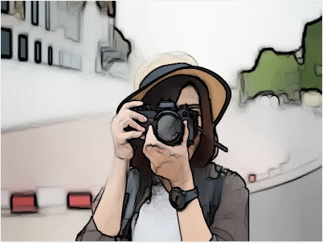

# Cartoonify Image with OpenCV and Pillow

This project allows you to cartoonify an image using OpenCV and Pillow frameworks. Cartoonifying is a process of applying stylized transformations to an image to make it look like a cartoon.

## Features

- Converts input images into cartoon-style images.
- Uses OpenCV for edge detection and smoothing.
- Uses Pillow for image manipulation.

## Requirements

- Python 3.7+
- OpenCV
- Pillow

Install the required libraries using the following command:
```bash
pip install opencv-python pillow
```

## Output
The cartoonified image will be displayed

## Example Input and Output
### Input


### Output


## Contributing
Feel free to fork this repository and contribute by submitting pull requests for additional features or improvements.

## License
This project is open and free to use under an open free license.